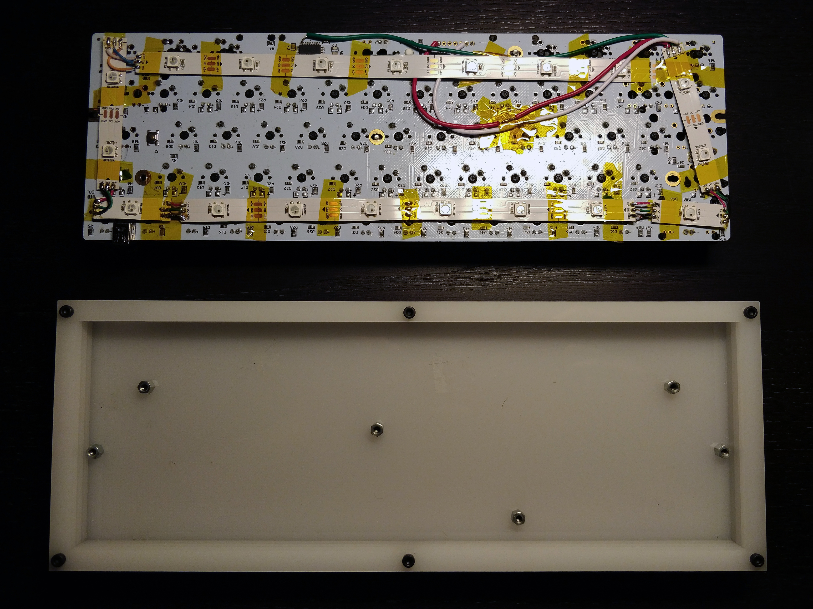

# Kilauea

## Case
The case for Kilauea is made of four layers of lasercut acrylic. The PCB is secured to the case via six M3 selftapping screw-ins that are put into the bottom layer (see the PCB picture further down for reference). The layers themselves are hold together through six M3x2,8 bolts and M3 nuts (both in black). Additional nuts with Sugru work as the feets of the board.

Links:
+ [Vectors for bottom layer](./case_bottom_layer.eps)
+ [Vectors for top layers](./case_top_layers.eps)
+ [Selftapping screw-ins](http://www.segor.de/#Q=M3%252FSt2%252C9x5SS%252F-4x&M=1) (Local shop in German, link mostly for reference purposes)

## The glow
To achieve the necessary underglow with the GH60 Satan PCB, additional WS2812b LEDs had to be soldered to the underside of the board. The strips are put as close to the edges as possible to get as much of their lights into the sides of the case as possible. The following picture shows what was done.

Also orange 1.8mm LEDs where put into the switches to complete the full backlighting effect necessary for the targeted look of the board.

## QMK Layout

Layout for QMK can be found [here](https://github.com/kwerdenker/qmk_firmware/tree/satan_iso_de/keyboards/satan/keymaps/kwerdenker_iso_de)
